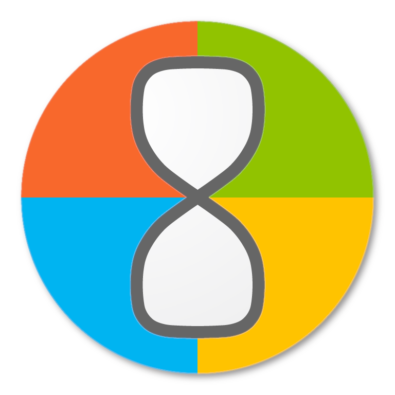
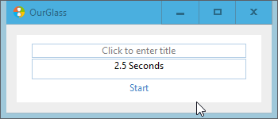

<h1 align="center">
  
   
  OurGlass
</h1>

<h2 align="center">Tiny timer for Windows</h2>

<h5 align="center">
  </a>
   
  <i>Rust port of <a href="https://github.com/dziemborowicz/hourglass">Hourglass</a></i>
</h5>

## Metrics

|📈 Metric| OurGlass| Hourglass|
|--------|--------|--------|
|⚖️ Filesize|🪶 ½ mb|🐘 1 mb|
|🕑 Startup time|🏃 0.2 sec|🐌 1.4 sec|
|💻 Language|🦀 Rust|🤮 C#|

<h1 align="center">
  🚧 Work in Progress 🚧</a>
</h1>
